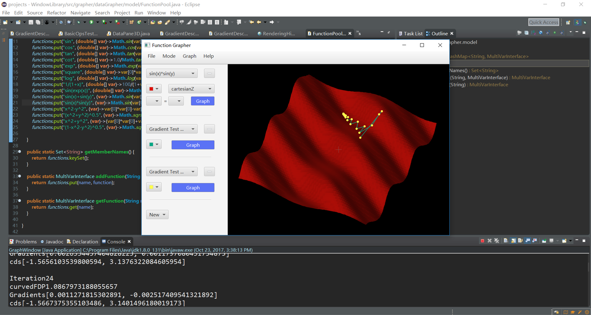
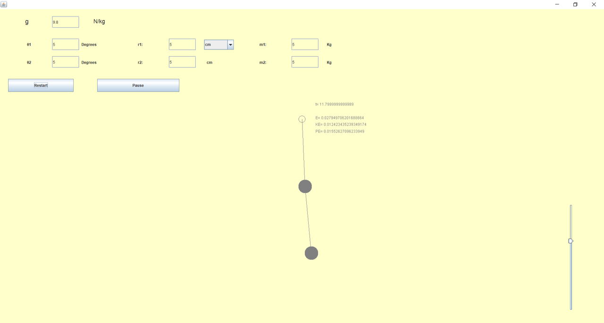
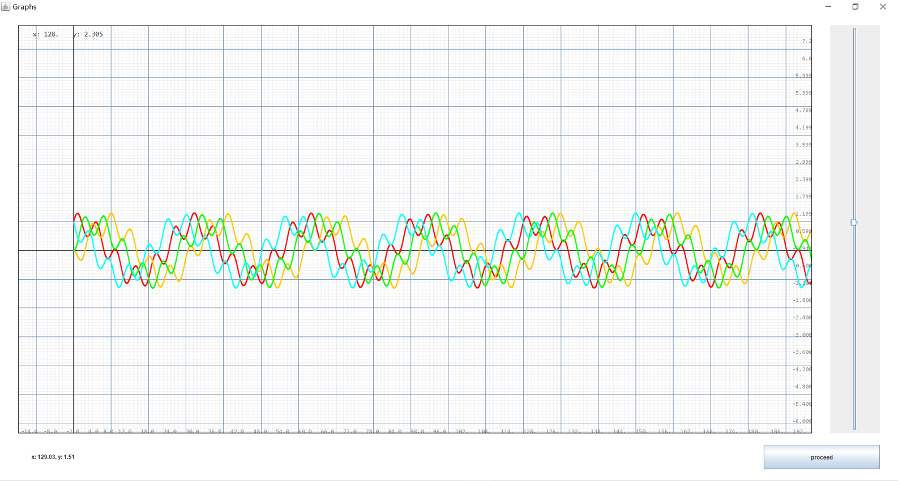
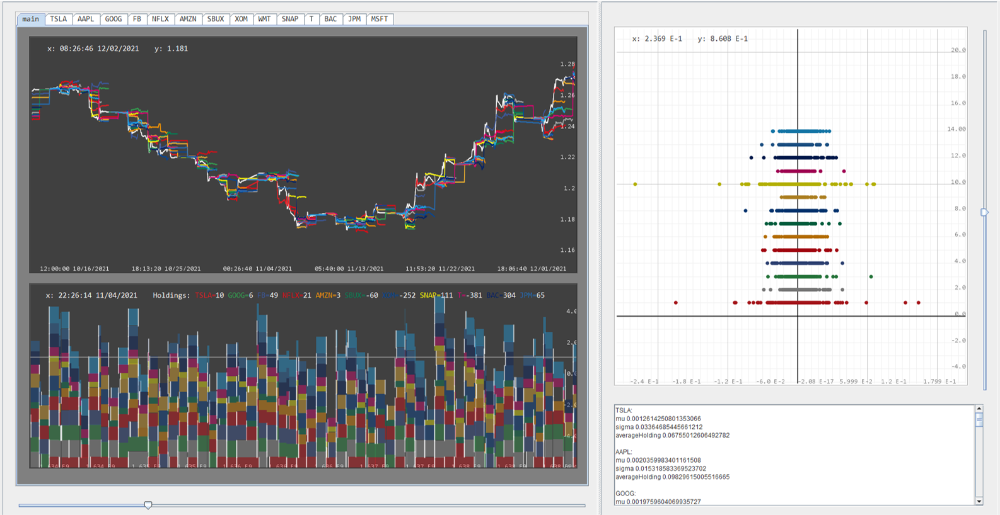

# Java-UI
A light weight toolset that allows you to build Java UI and create plot visualizations instantly.

## Components
* ScaleLayout: an implementation of layout manager that takes care of all the sizing
* Locator: Graphics coordinatization
* DataPane2D: Function based high quality plotting
* DataPane3D: Plotting of 3-dimensional surfaces and data
* Dataset and its subclasses

## Examples
- Gradient descent visualization

- Double pendulum simulation

- Functional plotting

- Data visualization

## Dependency
Miscelaneous algorithms from LDK library
